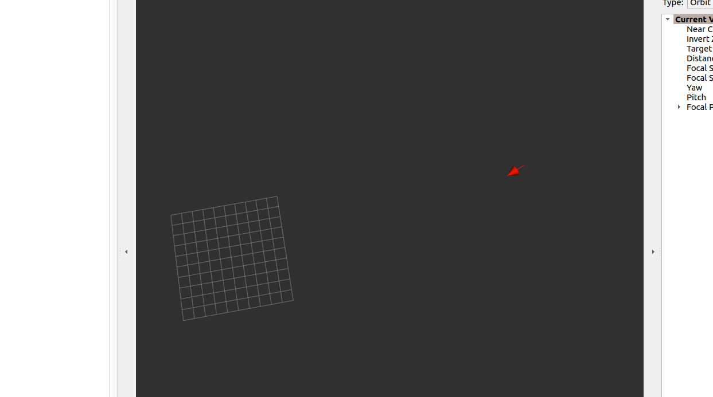

With vanilla Visualization
1. Launch this package with visualization
   `ros2 launch roar_robot_localization robot_localization_visualize.launch.py`

2. launch bag / physical GPS
`ros2 launch roar_robot_localization robot_localization.launch.py`

TODO: 
1. Figure out why `robot_localization` is not emitting any `/odometry` data

